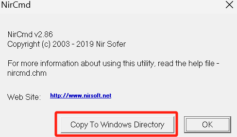
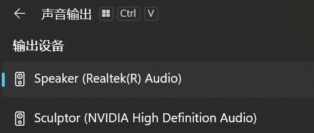

# SoundSurfer

## 项目简介
SoundSurfer 是一个自动音频设备切换工具。它可以根据指定窗口在不同显示器上的移动，自动切换系统默认音频输出设备，适用于多屏办公场景。
（其实是主包自己的小出租屋有一个副屏对着床当电视用，然后经常出现上了床打开发现没有手动切换音频输出，还是笔记本的声音🥲，于是摸鱼摸出了这个小项目）
****

## 功能特点
- 监控指定窗口（如浏览器、播放器等）的位置
- 当窗口移动到不同显示器时，自动切换到对应的音频设备
- 支持自定义监控窗口和显示器-音频设备映射
- 提供窗口选择工具，方便设置需要监控的窗口
****

## 功能更新
- 0803 新增耳机模式，可以通过“Ctrl+空格”来进行模式切换。

## 使用方法

### 依赖安装
请确保已安装以下 Python 库（测试使用python=3.10.18）：
```sh
pip install screeninfo pygetwindow pywin32
```
下载nircmd工具 "nircmd.exe"（项目文件中已提供）,管理员身份运行并点击Copy。



如无法复制请手动将文件移动到 "C:\Windows"。
****

### 配置文件
编辑 `config.json` 文件，设置需要监控的窗口标题和显示器对应的音频设备：
```json
{
    "window_titles": ["Edge"],
    "screen_devices": {
        "DISPLAY1": "Speaker",
        "DISPLAY2": "Sculptor"
    },
    "not_found_threshold": 10,
    "check_interval": 1
}
```
- **not_found_threshold** 表示连续检测不到目标窗口多少次后自动退出程序。
- **check_interval** 表示监控频率，数值越小检测越频繁。
- **screen_devices**配置成自己的音频输出设备名称


****

### 选择监控窗口
运行窗口选择工具，弹窗选择需要监控的窗口：
```sh
python select_window.py
```
选择后会自动更新配置文件。
****

### 启动音频切换服务
运行主程序开始监控
```sh
python audio_switcher.py
```